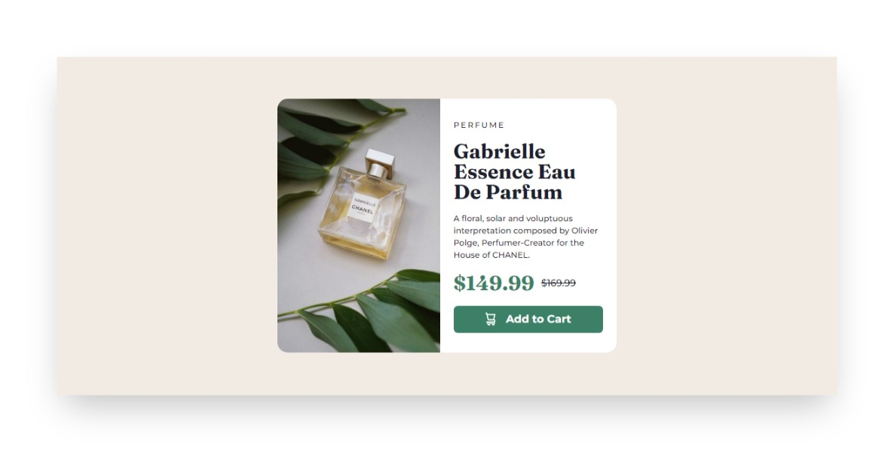
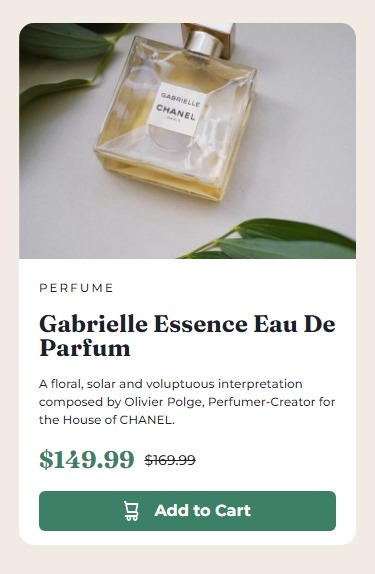

# Frontend Mentor - Product preview card component solution

This is a solution to the [Product preview card component challenge on Frontend Mentor](https://www.frontendmentor.io/challenges/product-preview-card-component-GO7UmttRfa). Frontend Mentor challenges help you improve your coding skills by building realistic projects. 

## Table of contents

- [Overview](#overview)
  - [The challenge](#the-challenge)
  - [Screenshot](#screenshot)
  - [Links](#links)
- [My process](#my-process)
  - [Built with](#built-with)
  - [What I learned](#what-i-learned)
  - [Continued development](#continued-development)
- [Author](#author)

## Overview

### The challenge

Users should be able to:

- View the optimal layout depending on their device's screen size
- See hover and focus states for interactive elements

### Screenshot




### Links

- Solution URL: [Add solution URL here](https://your-solution-url.com)
- Github: [Github](https://github.com/taufiqmahdi/Product-Preview-Card-Component-Next-JS)
- Live Site URL: [Live URL Using Vercel](https://product-preview-card-component-next-js.vercel.app/)

## My process

### Built with

- Semantic HTML5 markup
- Flexbox
- Mobile-first workflow
- [React](https://reactjs.org/) - JS library
- [Next.js](https://nextjs.org/) - React framework
- [Chakra UI](https://chakra-ui.com/) - For styles

### What I learned

In this project, I learned using custom breakpoints, custom color using extendTheme from Chakra UI.

```js
...

const colors = {
  primary: {
    darkCyan: "hsl(158, 36%, 37%)",
    cream: "hsl(30, 38%, 92%)",
  },
  neutral: {
    veryDarkBlue: "hsl(212, 21%, 14%)",
    darkGrayishBlue: "hsl(228, 12%, 48%)",
    white: "hsl(0, 0%, 100%)",
  },
};

const breakpoints = {
  mobile: '0px',
  desktop: '374px'
}

const theme = extendTheme({ colors, breakpoints });

function MyApp({ Component, pageProps }) {
  return (
    <ChakraProvider theme={theme}>
      <Layout>
        <Component {...pageProps} />
      </Layout>
    </ChakraProvider>
  );
}

...
```

### Continued development

Using breakpoints for each dimension so viewer can see better in each dimension they are currently using.

## Author

- Frontend Mentor - [@taufiqmahdi](https://www.frontendmentor.io/profile/taufiqmahdi)
- Twitter - [@taufiqmhdi](https://www.twitter.com/taufiqmhdi)